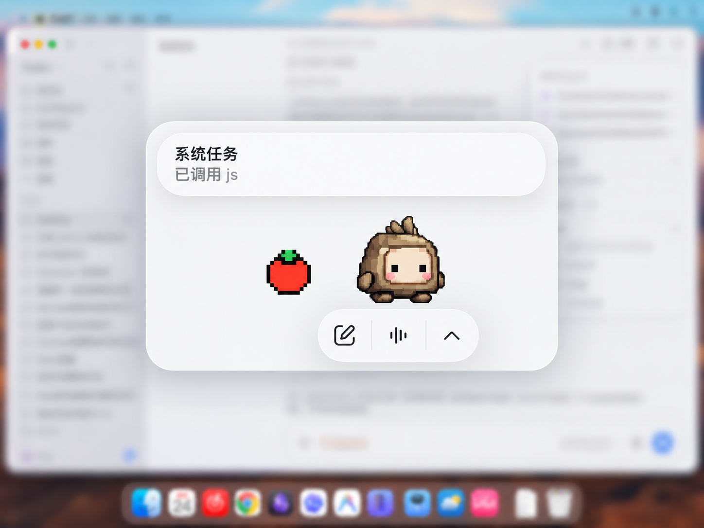
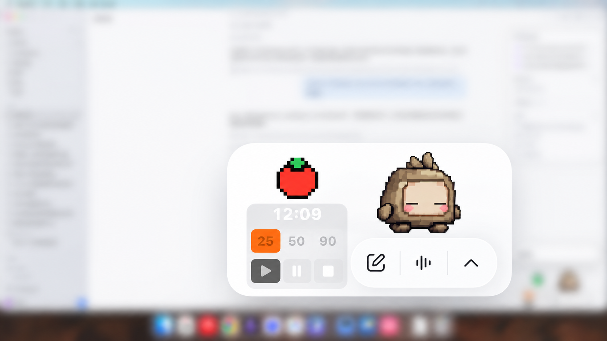
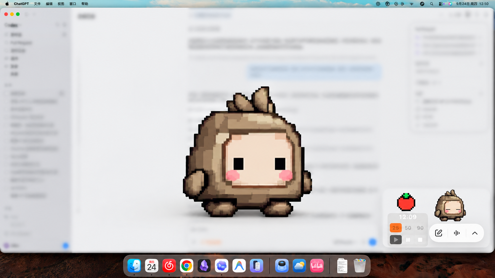

# Pet Pomodoro

[](LICENSE)
[](https://github.com/Xmemo/codex-pet-pomodoro/releases)

[简体中文](README.zh-CN.md) | English

**Human Life × Ultradian Rhythm × Pomodoro, with your Codex pet**

A research-informed Pomodoro timer for macOS, inspired by Huberman Lab's discussion of ultradian rhythms. It lives beside your Codex pet during focus and turns that same pet into a prominent, calm break cue when it is time to pause.

## Product Visuals

These AI-generated/composited product illustrations are for presentation; they are not unaltered screen recordings or proof of a particular runtime state.

<p align="center">
  
  <br><em>The timer and pet stay visually connected as one companion.</em>
</p>

<p align="center">
  
  <br><em>Choose a 25, 50, or 90 minute focus rhythm beside your pet.</em>
</p>

<p align="center">
  
  <br><em>At the recovery boundary, the pet grows into a calm, enlarged presence.</em>
</p>

> [!WARNING]
> **Unofficial Disclaimer**: This project is an independent community tool. It is **not** affiliated with or endorsed by OpenAI. It does not bundle OpenAI logos or proprietary pet assets.

---

## Why This Pomodoro Is Different

**Science-informed rhythm.** Huberman Lab's focus toolkit popularized bounded focus bouts followed by deliberate recovery. Pet Pomodoro translates that ultradian-rhythm framing into three practical work/rest choices. The intervals are options to test, not a claim that every brain follows one exact clock.

**A pet that makes the pause visible.** The compact tomato dial stays with your existing Codex pet while you work. At the break boundary, the pet expands from its usual position into a large, calm idle presence. This creates a noticeable pause in the visual flow without locking the Mac or taking control of the mouse.

- **25/50/90 rhythms**: three starting points for different kinds of work:
  - `25` (standard Pomodoro / 25 minutes work, 5 minutes rest)
  - `50` (flow / 50 minutes work, 10 minutes rest)
  - `90` (deep focus / 90 minutes work, 20 minutes rest)
- **Pet-led rest takeover**: when work ends, the native pet becomes a large, low-motion visual cue for recovery rather than a separate timer window.
- **Local records for AI analysis**: goals, timing events, and completion states are stored in SQLite and can be exported as JSON for analysis chosen by the user.
- **Local-first runtime**: no cloud dependency, telemetry, hosted dashboard, or runtime network requirement.

---

## How It Works

1. Choose `25/5`, `50/10`, or `90/20`.
2. Work with the compact tomato dial beside your Codex pet.
3. At rest time, the pet grows into a fullscreen, low-motion idle presence.
4. Let the visual transition interrupt continued work and create a real recovery boundary.
5. Keep local session history for later reflection or AI-assisted pattern analysis.

---

## Huberman Lab, Ultradian Rhythm, and 90 Minutes

Huberman Lab's *Focus Toolkit* recommends focus bouts of about 90 minutes or less, followed by deliberate decompression. This influential science-communication framework is the product inspiration behind the `90/20` option.

Research also supports the mechanisms behind the product:

- In a real-life study, predetermined breaks were associated with less fatigue and distraction and greater concentration and motivation than self-regulated breaks.
- Meta-analytic evidence supports short breaks for improving vigor and reducing fatigue.
- A meta-analysis of 158 studies found moderate associations between time management, performance, and well-being.
- Systematic review evidence shows that computer prompts can measurably change break and activity behavior.

`90/20` remains an optional experiment, not a biological prescription. Research does not establish one exact interval for every person or task, and this software has not itself been clinically tested. See [Scientific Basis and Claim Boundaries](docs/research/scientific-basis.md) for the evidence-to-feature mapping and complete source list.

---

## Privacy

Pet Pomodoro stores goals and session history locally in `~/.codex/ultradian-rhythm`. It does not upload session data, run telemetry, or call an AI model. The companion may request the macOS permission labeled “Screen & System Audio Recording”: when window metadata alone cannot locate the pet, it captures the matching ChatGPT/Codex window's pixels in memory to find the pet's visual position. It does not capture audio. The image is used locally for positioning and is not saved or transmitted by the app. Denying permission disables that visual-matching path; it does not send screen content elsewhere.

Review exported history before sharing it: goals and timing can reveal private work context. See [Local Data and User-Directed AI Analysis](docs/data-and-ai-analysis.md).

## Scope And Limits

- **Source-only installation**: The source code is compiled locally during installation using Xcode Command Line Tools. We do not distribute pre-compiled, Apple-signed binaries. Release archives receive provenance attestations; these are not Apple code signatures or notarization.
- **Display Differences**: Layout may vary with monitor arrangement, notch configuration, and macOS Spaces.
- **No Cross-Platform Support**: Built natively for macOS using Swift, AppKit, and LaunchAgents. Windows, Linux, and mobile OSs are not supported.
- **No Built-in AI, Review UI, or Dashboard**: The timer stores local session records and exposes CLI history, but the simplified v0.1.0 panel does not collect reviews. It does not upload data, call an AI model, score productivity, or provide a hosted analytics dashboard.
- **Not Medical Advice**: This is a focus timer, not a medical device or a treatment for attention, sleep, or health conditions.
- **No Official Affiliation**: Unaffiliated with OpenAI or any official project.
- **Screen Access**: Visual pet tracking can request macOS screen-capture permission for the ChatGPT/Codex window; see the [privacy details](docs/data-and-ai-analysis.md).

---

## Prerequisites

- **macOS**.
- **Python 3.11 or newer** available as an executable Python.
- **Node.js**. The installer first tries bundled Node from Codex or ChatGPT, then falls back to `node` on `PATH`.
- **Xcode Command Line Tools** with `xcrun swiftc` available for the Swift renderer build.
- **GitHub CLI (`gh`)** to verify signed release provenance before installation.

---

## Pet Compatibility

Compatible Codex pet packages work without companion-specific assets. The engine reads the configured pet ID and uses the standard atlas:

- Enter: neutral first frame during the geometric expansion
- Rest: calm idle presentation; Rocky uses a bounded blink sequence about every three seconds, while unsupported profiles remain on a stable idle frame
- Exit: current frame during the geometric shrink transition

Custom pets are read from `~/.codex/pets`. For compatible built-in pets, the provider reads only the matching atlas entry from the installed app's ASAR and caches that entry locally. It never modifies the app or redistributes the atlas.

Enhanced pet packages may include `companion.json` next to `pet.json` to provide dedicated `enter`, `rest`, and `exit` animation clips (schemaVersion 1 frame files or schemaVersion 2 atlasFrames/restHeightRatio). See:

- [companion-json-schema.md](docs/contracts/companion-json-schema.md)
- [examples/example-pet/](examples/example-pet/)

Validate a package:

```bash
node bin/codex-pet-companion.js validate-pet examples/example-pet
```

Preview an installed pet package:

```bash
codex-pet-companion preview --pet example-pet --state rest
```

Preview loads pets from the normal Codex pet directory. The bundled `examples/example-pet` package is a redistributable geometric example for validation and tests.

> [!IMPORTANT]
> **No Proprietary Assets**: This open-source repository does **not** package or bundle any proprietary pet assets or graphics from official platforms. Only the minimal geometric demonstration package is included.

---

## Install with Codex

To install via Codex, copy the following instruction and paste it directly into your Codex agent:

> Install Pet Pomodoro using the contract in [INSTALL_WITH_CODEX.md](INSTALL_WITH_CODEX.md) from https://github.com/Xmemo/codex-pet-pomodoro. Verify the release archive's GitHub artifact attestation with the `gh` CLI, pinned repository, release workflow, and version tag before executing the installer. Also compare the archive with `SHA256SUMS`; do not modify `ChatGPT.app` or `Codex.app`. Report the `ultradian` and `codex-pet-companion` status checks.

*Note: Codex may request network and filesystem approval permissions during the installation process.*

The installer verifies a Sigstore-backed GitHub artifact attestation for the archive, bound to this repository, the release workflow, and the version tag. SHA256 detects archive/checksum mismatch; attestation verifies workflow provenance, not that source code is harmless. The existing `v0.1.0` release predates this check and is not attested; use a later release produced by the attested workflow. This still trusts the repository maintainers and GitHub Actions configuration.

### Install from the Codex CLI

Run this in Terminal to open an interactive Codex session with the installation request:

```bash
codex 'Read https://github.com/Xmemo/codex-pet-pomodoro/blob/main/INSTALL_WITH_CODEX.md and follow its installation contract. Install only from a release newer than v0.1.0 whose archive passes both SHA256 and GitHub attestation verification for this repository, release workflow, and exact tag. If no such release exists, stop. Preserve normal approval prompts; never use sudo or bypass approvals.'
```

Codex will ask before actions that need approval. The current `v0.1.0` release is not attested, so the CLI instruction must stop until a later verified release is published.

---

## Manual Installation

Run from the repository root:

```bash
./scripts/install.sh
```

The installer copies the project into the current user's local application data, installs CLI wrappers under `~/.local/bin`, and writes these LaunchAgents:

- `~/Library/LaunchAgents/io.github.codex-ultradian-rhythm.plist`
- `~/Library/LaunchAgents/io.github.codex-pet-companion.plist`

Payload staging, compile, and activation swap roll back before the new payload is committed. After the payload is committed, timer service failure attempts to restore an explicitly configured legacy service; companion failure stops the companion service but keeps the verified new timer and existing state.

---

## CLI

### Timer Commands

```bash
ultradian status
ultradian status --json
ultradian start start --goal "Draft the release notes"
ultradian start flow --goal "Finish the installer test"
ultradian start deep --goal "Write the architecture section"
ultradian start deep --goal "Replace the current session" --replace
ultradian pause
ultradian resume
ultradian stop
ultradian repeat
ultradian history --limit 50 --json
ultradian notify-test
```

### Companion Commands

```bash
codex-pet-companion validate-pet <path>
codex-pet-companion preview --pet <id> --state enter
codex-pet-companion preview --pet <id> --state rest
codex-pet-companion preview --pet <id> --state exit
codex-pet-companion start
codex-pet-companion stop
codex-pet-companion status
codex-pet-companion config set pet auto
codex-pet-companion config set pet <id>
```

Command contracts are documented in [cli-commands.md](docs/contracts/cli-commands.md) and [visual-event-protocol.md](docs/contracts/visual-event-protocol.md). See [Local Data and AI Analysis](docs/data-and-ai-analysis.md) for the history schema, export workflow, and a reusable analysis prompt.

---

## Privacy & Security

- **Local-Only Operations**: No telemetry, remote analytics, or remote logging. Session records stay on your machine unless you explicitly export and share them.
- **No Background Network Activity**: The application does not listen to public ports or reach out to external servers.
- **Clean Execution**: Run fully under user-space directory contexts (`~/.local/` and standard macOS paths).
- **Inspectable Records**: Historical sessions are stored at `~/.codex/ultradian-rhythm/sessions.sqlite`. Use `ultradian history --limit 50 --json` for a read-only export.

---

## Troubleshooting

- **Swift Renderer Compilation Fails**: Ensure Xcode Command Line Tools are installed via `xcode-select --install`.
- **CLI Commands Not Found**: Ensure `~/.local/bin` is added to your terminal environment `PATH` variable.
- **LaunchAgents Not Running**: Check status with `launchctl list | grep codex` or inspect `~/Library/Logs/` for logs.

---

## Uninstall

Default uninstall removes LaunchAgents and installed binaries while preserving timer state:

```bash
./scripts/uninstall.sh
```

Remove local timer state as well:

```bash
./scripts/uninstall.sh --purge-state
```

---

## Roadmap

- [ ] Support custom overlay coordinates and notch adjustments.
- [ ] Improved transparent window rendering options.
- [ ] Expanded schema definitions for custom frame rates.
- [ ] Optional local reports built on the existing history export.

---

## Contributing

Contributions are welcome! Please review [CONTRIBUTING.md](CONTRIBUTING.md) to understand the guidelines for submitting issues and pull requests.

---

## License

This project is licensed under the [MIT License](LICENSE).
